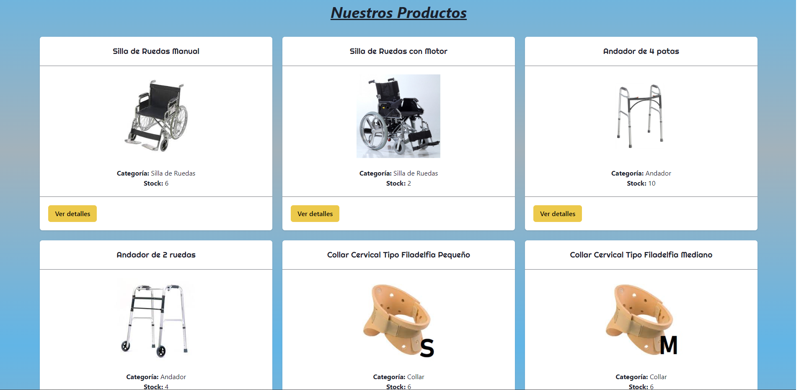
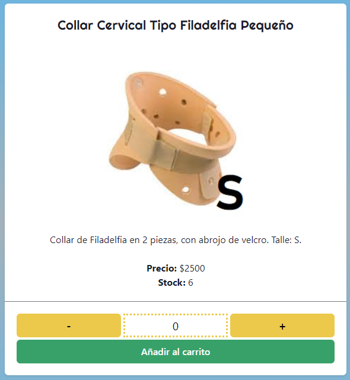
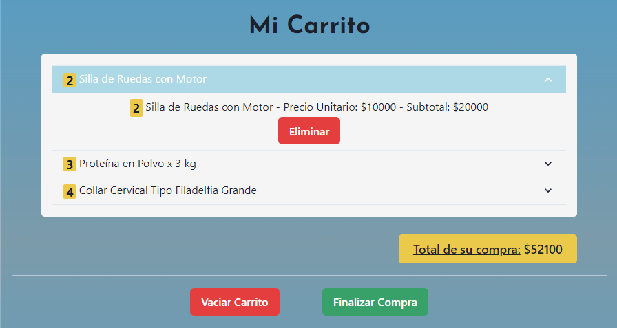

# Ortopedia FixSalud
## Proyecto Final para el Curso de ReactJS de Coderhouse: E-Commerce

### *Descripción del Proyecto*
Este es el resultado final del proyecto creado para el curso de ReactJS de Coderhouse, el cual constaba en realizar un E-commerce completamente funcional, incluyendo el uso de un carrito de compras, un catálogo de productos y detalles de los mismos.

### *Tecnologías Utilizadas*
<ins>Para este proyecto, se utilizaron las siguientes tecnologías:</ins>
1. HTML5
2. CSS3
3. JavaScript
4. ReactJS (mediante Vite)
5. Firebase
6. ChakraUI
7. React-Icons (requiere instalación previa, ver debajo)

---

### *Componentes del Proyecto*
<ins>El proyecto contiene las siguientes partes:</ins>

* **Landing Page:**


* **Catálogo de Productos:**



* **Detalle de Producto:**



* **Carrito de Compras:**



---

### *Ejecución de la Aplicación*

Previo a la ejecución de la aplicación, se recomienda la instalación de React-Icons, ya que permitirá una mejor visualización de la aplicación. Para 
ésto, en la terminal, se debe ejecutar el siguiente comando:

```
npm install react-icons --save
```

Para ejecutar la aplicación, debe abrirse una terminal y ubicarse en el directorio del E-commerce (/eiroacommerce). Una vez en el directorio, ejecutar:

```
npm run dev
```

<ins>Esto dará un link a un host local</ins>. Haciendo click en el mismo abrirá la aplicación en el navegador

---

### *Créditos*
Código escrito por **Juan Manuel Eiroa**.
Agradecimientos al equipo de **Coderhouse**, incluyendo tutores y profesores del curso de ReactJS, que ayudaron a que esta aplicación web sea posible; así como también a quienes generaron las librerías y frameworks utilizados para este proyecto <ins>**(Vite, React-Icons, ChakraUI)**</ins>.
